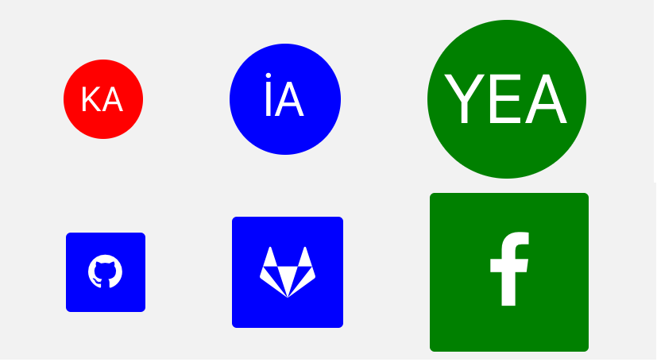

import { Playground, Props } from 'docz'
import {Avatar, Badge, Button} from '../../src/components'

# Avatar
Avatar, listelerde, profil ekranları gibi birçok kullanıcı arabirimi tasarımlarında bulunur. 
Bir kullanıcıyı temsil etmek için kullanılır. Fotoğraf, simge veya metin içerebilirler. 
React bileşeni olan “TouchableHighlight” ve “View” bileşeni kullanılarak geliştirilmiştir.



## Usage

``` js
import { Avatar } from 'react-native-pinecone';

<Avatar
    value="KA"
    size="small"
    backgroundColor="red"
    onPress={() => alert("KA")} />

<Avatar
    value="İA"
    size="medium"
    backgroundColor="blue"
    onPress={() => alert("İA")} />

<Avatar
    value="YEA"
    size="large"
    backgroundColor="green"
    onPress={() => alert("YEA")} />

<Avatar
    type="square"
    icon={{ name: "github", color: "white" }}
    size="small"
    backgroundColor="blue"
    onPress={() => alert("GitHub")} />

<Avatar
    type="square"
    icon={{ name: "gitlab", color: "white" }}
    size="medium"
    backgroundColor="blue"
    onPress={() => alert("GitLab")} />

<Avatar
    type="square"
    icon={{ name: "facebook", color: "white" }}
    size="large"
    backgroundColor="green"
    onPress={() => alert("Facebook")} />
```

## Props

<Props of={Avatar} />