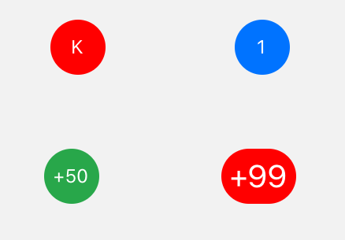

import { Playground, Props } from 'docz'
import { Badge } from '../../src/components'

# Badge
Badge, genel olarak sayılarla birlikte bir öğenin durumunu kullanıcıya göstermek için kullanılan küçük bileşenlerdir. 
React bileşeni olan “View” bileşeni kullanılarak geliştirilmiştir.



## Kullanımı

``` js
import { Badge } from 'react-native-pinecone'

<Badge value="K" color="red" />

<Badge value="1" primary />

<Badge value="+50" success />

<Badge value="+99" valueStyle={{fontSize: 20}} />
```

## Sahne Donanımları (Props)

<Props of={Badge} />