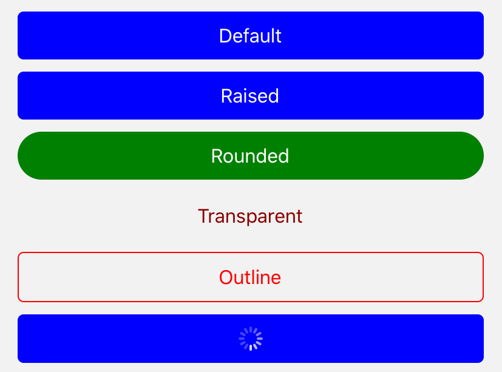

import { Playground, Props } from 'docz'
import { Button } from '../../src/components'

# Button
Button’lar, ekranla etkileşim kurabilmek için kullanılan dokunmatik bileşenlerdir. 
Metin, simge veya her ikisini de aynı zamanda içlerinde barındırabilir. 
React bileşeni olan “TouchableOpacity” ve “TouchableHighlight” bileşenleri kullanılarak geliştirilmiştir.



## Kullanımı

``` js
import { Button } from 'react-native-pinecone'

<Button 
    title="Default" 
    type="default" 
    onPress={() => alert("Dokunuldu")} />

<Button 
    title="Raised" 
    shadow={3} 
    type="default" 
    onLongPress={() => alert("Uzun dokunuldu")} />

<Button 
    title="Rounded" 
    type="rounded" 
    color="green" 
    onPress={() => alert("Dokunuldu")} />

<Button 
    title="Transparent" 
    type="transparent" 
    color="darkred" 
    onPress={() => alert("Dokunuldu")} />

<Button 
    title="Outline" 
    type="outline" 
    color="red" 
    onPress={() => alert("Dokunuldu")} />

<Button 
    title="Loading" 
    loading 
    loadingStyle={{ color: "white" }} 
    onPress={() => alert("Dokunuldu")}  />

<Button 
    title="Disabled" 
    disabled 
    onPress={() => alert("dokunuldu")} />
```

## Sahne Donanımları (Props)

<Props of={Button} />