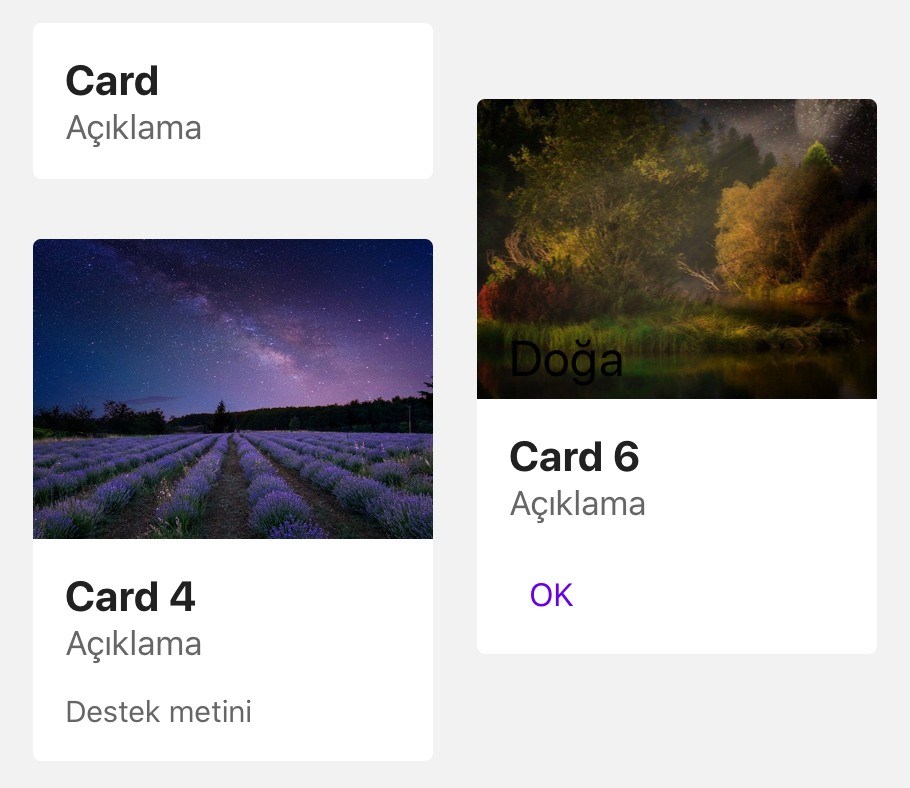

import { Playground, Props } from 'docz'
import { Card } from '../../src/components'

# Card
Card, tek bir konu hakkında içerik ve eylemleri barındırır. 
İçerisinde fotoğraf, metin, buton gibi şeyler içerebilir. 
React bileşeni olan “TouchableOpacity” bileşeni kullanılarak geliştirilmiştir.



## Kullanımı

``` js
import { Card } from 'react-native-pinecone'

<Card 
    title="Card" 
    description="Açıklama" 
    onPress={() => alert("Dokunuldu")} />

<Card 
    title="Card 4" 
    description="Açıklama" 
    supportText="Destek metini" 
    onLongPress={() => alert("Uzun dokunuldu")} 
    image={{ uri: "https://cdn.pixabay.com/photo/2019/10/04/18/36/milky-way-4526277_960_720.jpg" }} />

<Card 
    title="Card 6" 
    description="Açıklama" 
    onPress={() => alert("Dokunuldu")} 
    image={{uri: "https://cdn.pixabay.com/photo/2020/04/18/17/17/fantasy-5060076_960_720.jpg"}} 
    actionButtonOnPress={() => alert("Dokunuldu")} 
    imageTitle="Doğa" />
```

## Sahne Donanımları (Props)

<Props of={Card} />