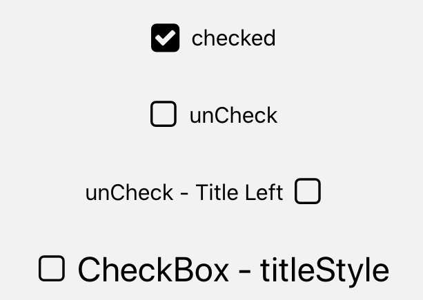

import { Playground, Props } from 'docz'
import { CheckBox } from '../../src/components'

# CheckBox
CheckBox, kullanıcının bir dizi seçenek arasından bir veya birden fazla öğe seçmesine olanak tanır. 
React bileşeni olan “TouchableOpacity” ve react-native-vector-icons paket bileşeni olan “Icon” bileşenleri kullanılarak geliştirilmiştir.



## Usage

``` js
import React from 'react';
import { CheckBox } from 'react-native-pinecone';

const [visible, setVisible] = useState(false); 

<CheckBox
    checked={visible}
    title="Check"
    onPress={() => setVisible(!visible)} />

<CheckBox
    checked={visible}
    title="unCheck"
    onPress={() => setVisible(!visible)} />

<CheckBox
    checked={visible}
    title="unCheck - Title Left"
    titleLeft onPress={() => setVisible(!visible)} />

<CheckBox
    checked={visible}
    title="CheckBox - titleStyle"
    titleStyle={{ fontSize: 25 }} />
```

## Props

<Props of={CheckBox} />