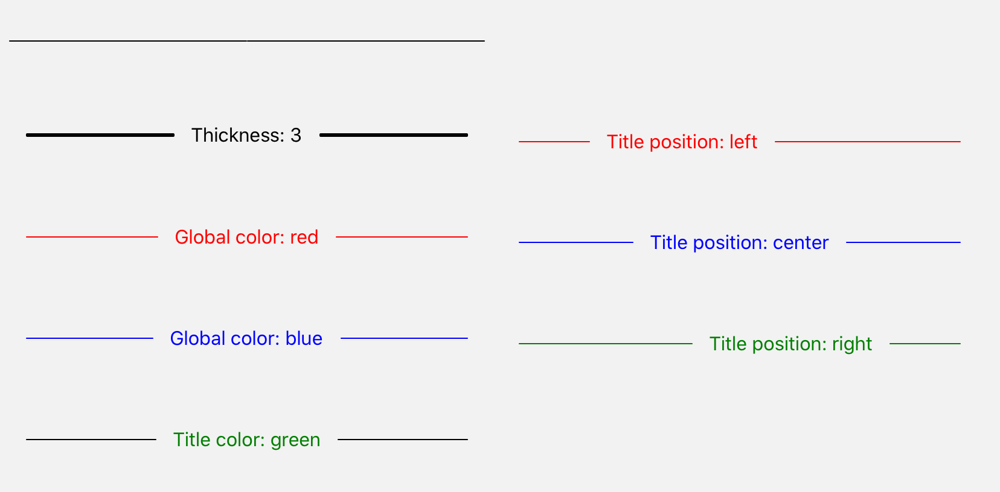

import { Playground, Props } from 'docz'
import { Divider } from '../../src/components'

# Divider
Divider, içerik bölümleri arasında görsel olarak bir ayrım yapmak kullanılır. 
React bileşeni olan “View” bileşeni kullanılarak geliştirilmiştir.



## Usage

``` js
import { Divider } from 'react-native-pinecone';

<Divider />

<Divider title="Thickness: 3" thickness={3} />

<Divider title="Global color: red" color="red" />

<Divider title="Global color: blue" color="blue" />

<Divider title="Title color: green" titleColor="green" />

<Divider title="Title position: left" color="red" titlePosition="left" />

<Divider title="Title position: center" color="blue" titlePosition="center" />

<Divider title="Title position: right" color="green" titlePosition="right" />
```

## Props

<Props of={Divider} />