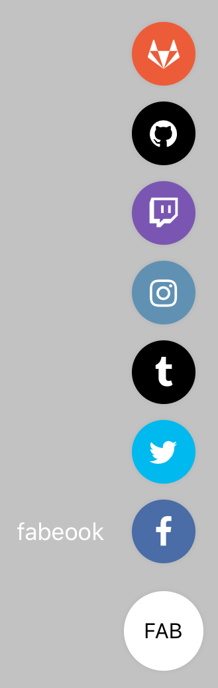

import { Playground, Props } from 'docz'
import { Fab } from '../../src/components'

# Fab
Yüzer eylem düğmesi (FAB), sabit bir konumda kullanıcı arabiriminin üzerinde yüzen daire şeklinde bir ikon veya başlık ile ayırt edilirler. 
Dokunulduğunda daha fazla ilgili eylem içerebilir. 
React bileşeni olan “TouchableWithoutFeedback” ve “View” bileşenleri kullanılarak geliştirilmiştir.



## Usage

``` js
import { Fab } from 'react-native-pinecone';

const action = [
    { icon: "facebook", label: "fabeook", backgroundColor: "#4A6CA7", onPress: () => alert("Facebook"), iconColor: "white" }, 
    { icon: "twitter", backgroundColor: "#00B9EF", iconColor: "white", iconProps: { onLongPress: () => alert("Twitter") } }, 
    { icon: "tumblr", backgroundColor: "#000000", iconColor: "white" }, 
    { icon: "instagram", backgroundColor: "#6091B2", iconColor: "white" }, 
    { icon: "twitch", backgroundColor: "#7A56B2", iconColor: "white" }, 
    { icon: "github", backgroundColor: "#000000", iconColor: "white", onPress: () => alert("GitHub") }, 
    { icon: "gitlab", backgroundColor: "#ED5C38", iconColor: "white" }]

<Fab actions={action} position="right" text="FAB" />
```

## Props

<Props of={Fab} />