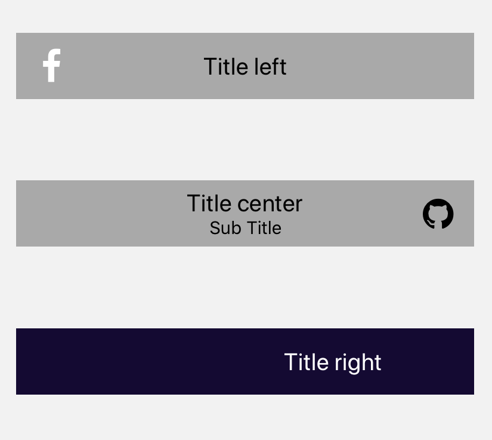

import { Playground, Props } from 'docz'
import { Header } from '../../src/components'

# Header
Ekranın üst kısmında başlık olarak kullanılacak bileşen. Ekran başlığı, gezinme düğmeleri, menü düğmesi vb. gibi kontrolleri içerebilir. 
React bileşeni olan “View” bileşeni kullanılarak geliştirilmiştir.



## Usage

``` js
import { Header } from 'react-native-pinecone';

<Header
    title="Title left"
    backgroundColor="#A9A9A9"
    leftIcon={{ name: "facebook", color: "white" }}
    leftIconOnPress={() => alert("Tıklandı")} />

<Header
    title="Title center"
    subTitle="Sub Title"
    placement="center"
    backgroundColor="#A9A9A9"
    rightIcon={{ name: "github" }}
    rightIconOnPress={() => alert("Tıklandı")} />

<Header
    title="Title right"
    placement="right"
    titleColor="white"
    backgroundColor="rgb(20, 10, 50)" />
```

## Props

<Props of={Header} />