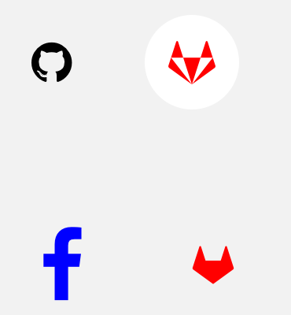

import { Playground, Props } from 'docz'
import { IconButton } from '../../src/components'

# IconButton
IconButton, Icon bileşeninde olduğu gibi, genellikle eylemi veya bir amacı tanımlamak için kullanılan görsel göstergelerdir. 
Aynı zamanda sade bir buton özelliği görmektedir. 
Bu bileşen react-native-vector-icons paket bileşeni olan “Icon” bileşeni kullanılarak geliştirilmiştir.



## Kullanımı

``` js
import { IconButton } from 'react-native-pinecone'

<IconButton 
    name="github" 
    onPress={() => alert("Dokunuldu")} />

<IconButton 
    name="gitlab" 
    color="red" 
    raised 
    onLongPress={() => alert("Uzun dokunuldu")} />
    
<IconButton 
    name="facebook" 
    color="blue" 
    size={50} 
    onLongPress={() => alert("Uzun dokunuldu")} 
    underlayColor="gray" />

<IconButton 
    name="gitlab" 
    type="AntDesign" 
    color="red" 
    onPress={() => alert("Dokunuldu")}  />
```

## Sahne Donanımları (Props)

<Props of={IconButton} />