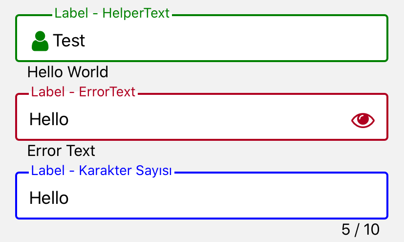

import { Playground, Props } from 'docz'
import { Input } from '../../src/components'

# Input
Klavye aracılığıyla uygulamaya metin girmek için temel bir bileşen. 
Sahne, otomatik düzeltme, otomatik büyük harf yapma, yer tutucu metin ve sayısal tuş takımı gibi farklı klavye türleri gibi çeşitli özellikler için yapılandırılabilirlik sağlar. 
React bileşeni olan “TextInput” bileşeni kullanılarak geliştirilmiştir.



## Kullanımı

``` js
import React from 'react'
import { Input } from 'react-native-pinecone'

const [value, setValue] = useState(""); 

<Input 
    value={value} 
    type="outlined" 
    labelColor="green" 
    label="Label - HelperText" 
    onChangeText={(value) => setValue(value)} 
    helperText="Hello World" 
    leftIcon={{ name: "user", color: "green" }} />

<Input 
    value={value} 
    type="outlined" 
    labelColor="green" 
    label="Label - ErrorText" 
    onChangeText={(value) => setValue(value)} 
    errorText="Error Text" 
    rightIcon={{ name: "eye" }} />

<Input 
    value={value} 
    type="outlined" 
    label="Label - Karakter Sayısı" 
    onChangeText={(value) => setValue(value)} 
    characterCounter 
    maxLength={10} />
```

## Sahne Donanımları (Props)

<Props of={Input} />