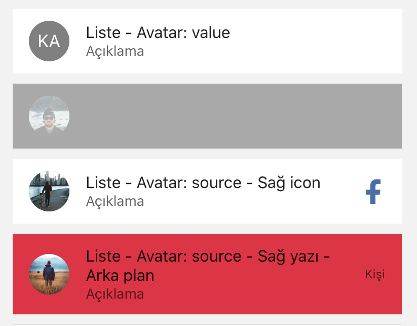

import { Playground, Props } from 'docz'
import { ListItem } from '../../src/components'

# ListItem
ListItem, kişi listesi, çalma listesi veya menü gibi bilgi satırlarını görüntülemek için kullanılır. 
Çok özelleştirilebilirler ve avatarlar, ikonlar ve daha fazlasını içerebilir. 
React bileşeni olan “TouchableHighlight” ve “View” bileşenleri kullanılarak geliştirilmiştir.



## Usage

``` js
import { ListItem } from 'react-native-pinecone';

<ListItem
    title="Liste - Avatar: value"
    leftAvatar={{ value: "KA" }}
    description="Açıklama"
    onPress={() => alert("Dokunuldu")} />

<ListItem
    title="Liste - Avatar: source - Disabled"
    disabled
    leftAvatar={{source:{required("./user.png")}}}
    description="Açıklama"
    onPress={() => alert("Dokunuldu")} />

<ListItem
    title="Liste - Avatar: source - Sağ icon"
    leftAvatar={{source:{ required("./user2.png")}}}
    description="Açıklama"
    onPress={() => alert("Dokunuldu")}
    rightIcon={{ name: "facebook", color: "#4A6CA7" }} />
    
<ListItem
    title="Liste - Avatar: source - Sağ yazı - Arka plan"
    leftAvatar={{source:{ required("./user.png")}}}
    description="Açıklama"
    backgroundColor="#DC3545"
    onPress={() => alert("Dokunuldu")}
    rightText="Kişi" />
```

## Props

<Props of={ListItem} />