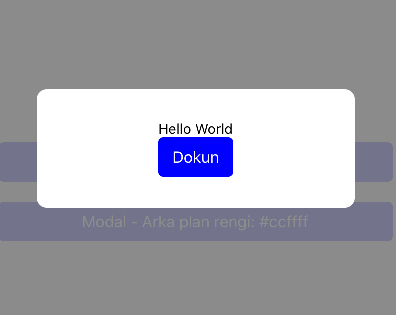

import { Playground, Props } from 'docz'
import { Modal, Button } from '../../src/components'

# Modal
Modal, kullanıcıları bir görev hakkında bilgilendirir ve kritik bilgiler içerebilir, kararlar gerektirebilir veya birden fazla görev içerebilir. 
React bileşeni olan “Modal” bileşeni kullanılarak geliştirilmiştir.



## Usage

``` js
import React from 'react';
import { View } from 'react-native';
import { Modal, Button } from 'react-native-pinecone';

const [visible, setVisible] = useState(false);

<Button
    title="Modal - onRequestClose ile"
    onPress={() => setVisible(!visible)} />

<Modal visible={visible} onRequestClose={() => setVisible(!visible)}>
    <View style={{ padding: 20 }}>
        <Text>Hello World</Text>
        <Button
            title="Dokun"
            onPress={() => alert("Dokunuldu")} />
    </View>
</Modal>
```

## Props

<Props of={Modal} />