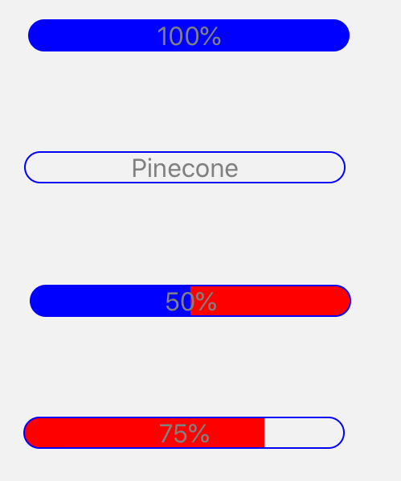

import { Playground, Props } from 'docz'
import { ProgressBar } from '../../src/components'

# ProgressBar
ProgressBar, uygulamadaki bazı etkinliklerin ilerlemesini göstermek için kullanılan bir göstergedir. 
React bileşeni olan “Animated.View” bileşeni kullanılarak geliştirilmiştir.



## Kullanımı

``` js
import { ProgressBar } from 'react-native-pinecone'

<ProgressBar showText value={100} />

<ProgressBar text="Pinecone" showText value={0} />

<ProgressBar showText unfilledColor="red" value={50} />

<ProgressBar showText filledColor="red" value={75} />
```

## Sahne Donanımları (Props)

<Props of={ProgressBar} />