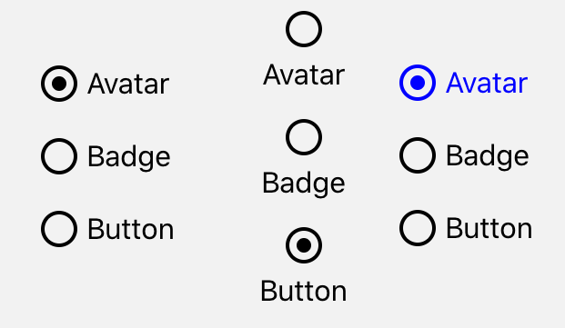

import { Playground, Props } from 'docz'
import { RadioButton } from '../../src/components'

# RadioButton
RadioButton, kullanıcının bir dizi seçenek arasından herhangi birini seçmesine izin verir. 
React bileşeni olan “TouchableOpacity” bileşeni kullanılarak geliştirilmiştir.



## Usage

``` js
import React from 'react';
import { RadioButton } from 'react-native-pinecone';

const [visible, setVisible] = useState(false); 

const radio = [
    { label: "Avatar", value: 0 },
    { label: "Badge", value: 1 },
    { label: "Button", value: 2 }
]

<RadioButton
    values={radio}
    onPress={(value) => setValue(value)} />

<RadioButton
    values={radio}
    labelHorizontal={false}
    onPress={(value) => setValue(value)} />

<RadioButton
    values={radio}
    selectedColor="blue"
    onPress={(value) => setValue(value)} />
```

## Props

<Props of={RadioButton} />