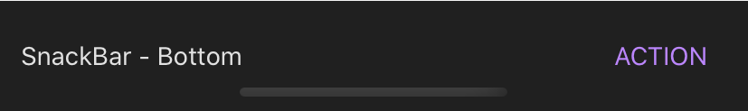

import { Playground, Props } from 'docz'
import { Snackbar } from '../../src/components'

# Snackbar
Snackbar, isteğe bağlı bir eylemle birlikte kullanıcıya kısa bir mesaj görüntülemek için kullanılır. 
Genelde ekranın altından animasyonlu şekilde görünür ve kısa bir süre sonra kaybolurlar. 
React bileşeni olan “Animated.View” bileşeni kullanılarak geliştirilmiştir.



## Usage

``` js
import React from 'react';
import { Snackbar } from 'react-native-pinecone';

const [visible, setVisible] = useState(false);

<Snackbar
    visible={visible}
    actionOnPress={() => alert("Dokunuldu")}
    text="SnackBar - Bottom" />
```

## Props

<Props of={Snackbar} />