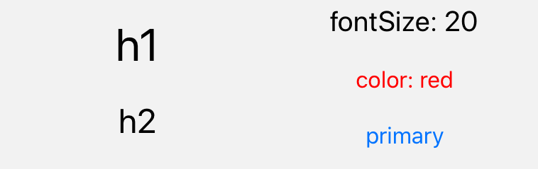

import { Playground, Props } from 'docz'
import {Text} from '../../src/components'

# Text
Metin görüntülemek için kullanılan bir bileşendir. React bileşeni olan “Text” bileşenini kullanılarak geliştirilmiştir.



## Usage

``` js
import { Text } from 'react-native-pinecone';

<Text h1>h1</Text>

<Text h2>h2</Text>

<Text fontSize={20}>fontSize: 20</Text>

<Text color="red">color: red</Text>

<Text primary>primary</Text>
```

## Props

<Props of={Text} />